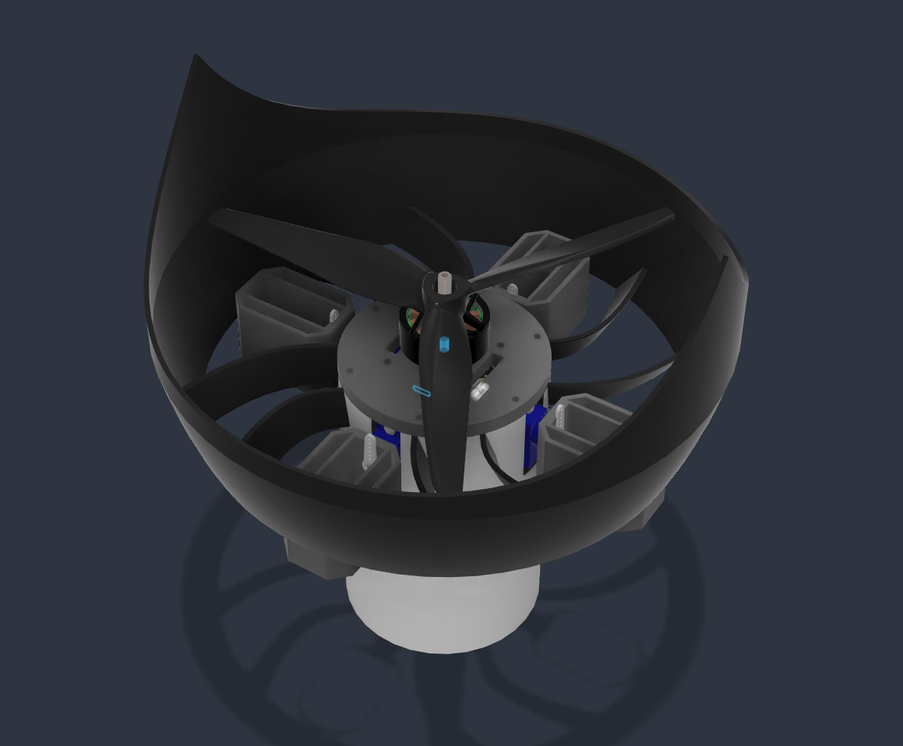
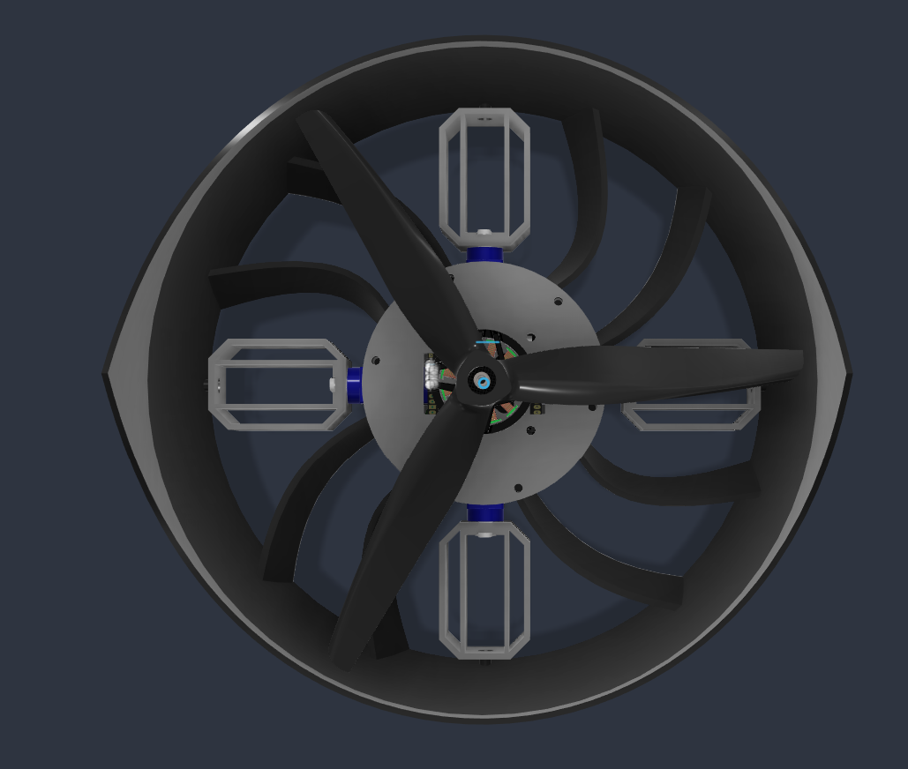
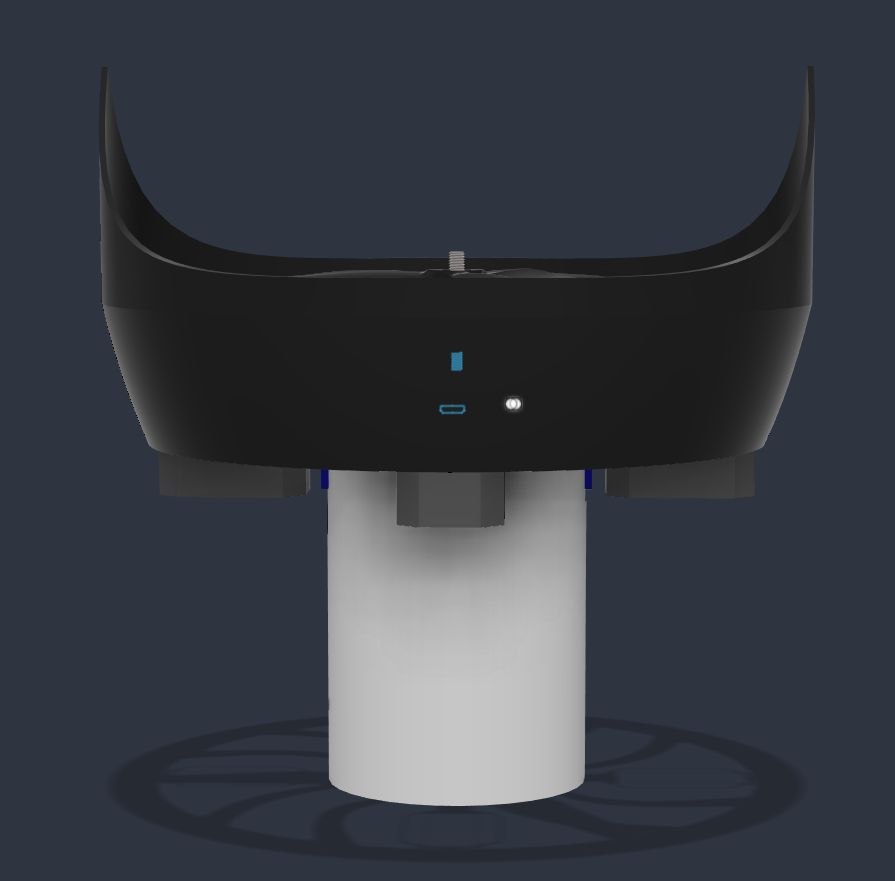
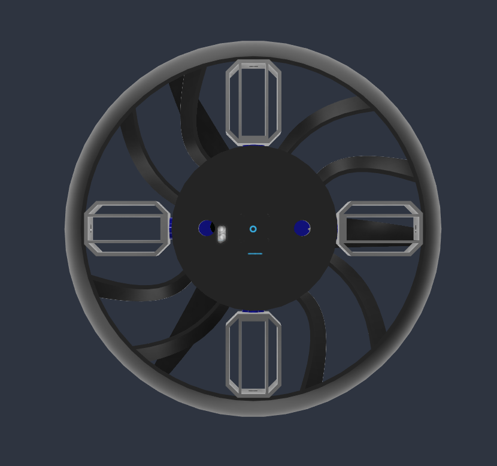

# Talon

Talon is a single motor ducted drone that uses thrust vectoring for flight control.

### CAD and Hardware Layout

The isometric view shows how the main parts package together. The motor and three blade propeller sit on the center top plate. Four micro servos sit around that middle ring, each hooked directly to one of the rectangular control vanes below. The duct wraps around the prop, with a raised lip on the cowl to help guide airflow into the blades.

Looking down into the duct shows the propeller sitting over eight curved stator vanes. Those stators connect the center motor mount to the outer ring. Their curve is shaped to catch the spinning air coming off the prop and straighten it out to cancel motor torque. Underneath the stators, the four control vanes sit at ninety degree intervals.

The side view shows the vertical layout. The white cylinder at the bottom houses the 4S battery, keeping the heaviest part of the build down low and centered directly under the thrust line. On the cowl, there are cutouts for the USB port and status LED so you can plug into the flight controller without taking the duct apart.

The bottom view shows the exhaust path. The four control vanes sit directly in the fastest air stream coming out of the duct. Each vane pivots on its own axis to deflect air for pitch, roll, and yaw. You can also see the wire routing holes and mounting points for the internal electronics plate.

### How It Works

A single brushless motor and three blade propeller sit at the top of the duct. 

Because a single prop creates rotational torque, eight curved stator vanes sit inside the duct to straighten the airflow and cancel out motor torque passively. 

Directly below the stators, four control vanes are connected to micro servos positioned at ninety degree intervals. Deflecting opposing pairs controls pitch and roll. Deflecting all four vanes together controls yaw and trims out any remaining motor torque.

The lower cylinder holds the battery to keep the heaviest component low and centered directly under the thrust axis.

### Measured Data and Specs

* Total flying weight: 550 grams
* Battery weight: 217 grams (4S pack)
* Airframe and electronics: 330 grams
* Expected thrust: 850 grams to 1190 grams
* Thrust to weight ratio: 1.55 to 2.17

### Mechanical and Control Notes

Control authority depends directly on prop wash speed. When throttle is low, the vanes have less air passing over them and react slower. 

The curved stator vanes handle the bulk of the motor torque during hover, leaving the four servo vanes to focus on attitude control and fine yaw adjustments. 

Linkages between the servos and control vanes need to be stiff to avoid flutter at full throttle.
